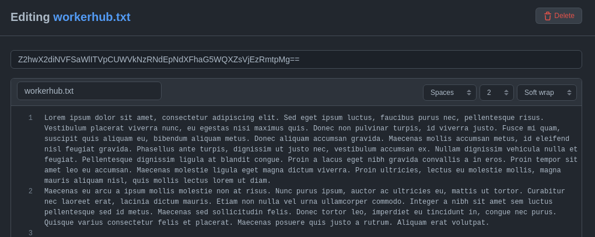
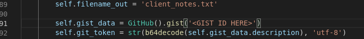
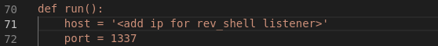
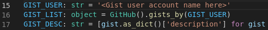

<div id="top"></div>
<!--
*** Thanks for checking out the Best-README-Template. If you have a suggestion
*** that would make this better, please fork the repo and create a pull request
*** or simply open an issue with the tag "enhancement".
*** Don't forget to give the project a star!
*** Thanks again! Now go create something AMAZING! :D
-->


<!-- PROJECT SHIELDS -->
<!--
*** I'm using markdown "reference style" links for readability.
*** Reference links are enclosed in brackets [ ] instead of parentheses ( ).
*** See the bottom of this document for the declaration of the reference variables
*** for contributors-url, forks-url, etc. This is an optional, concise syntax you may use.
*** https://www.markdownguide.org/basic-syntax/#reference-style-links
-->
[![Contributors][contributors-shield]][contributors-url]
[![Forks][forks-shield]][forks-url]
[![Stargazers][stars-shield]][stars-url]
[![Issues][issues-shield]][issues-url]
[![MIT License][license-shield]][license-url]
[![LinkedIn][linkedin-shield]][linkedin-url]


<!-- PROJECT LOGO -->
<br />
<div align="center">
  <a href="https://github.com/JochiRaider/VPI_FS_project">  
    
  
  </a>
  
                                               
<h3 align="center">GitHub based C2 Server</h3>

  <p align="center">
    A command and control server that uses a prepared github repository as it's backend 'server' and public gists for side band communication  
    <br />
    <a href="https://github.com/JochiRaider/VPI_FS_project"><strong>Explore the docs »</strong></a>
    <br />
    <br />
    <a href="https://github.com/JochiRaider/VPI_FS_project">View Demo</a>
    ·
    <a href="https://github.com/JochiRaider/VPI_FS_project/issues">Report Bug</a>
    ·
    <a href="https://github.com/JochiRaider/VPI_FS_project/issues">Request Feature</a>
  </p>
</div>


<!-- TABLE OF CONTENTS -->
<details>
  <summary>Table of Contents</summary>
  <ol>
    <li>
      <a href="#about-the-project">About The Project</a>
      <ul>
        <li><a href="#built-with">Built With</a></li>
      </ul>
    </li>
    <li>
      <a href="#getting-started">Getting Started</a>
      <ul>
        <li><a href="#prerequisites">Prerequisites</a></li>
        <li><a href="#installation">Installation</a></li>
      </ul>
    </li>
    <li><a href="#usage">Usage</a></li>
    <li><a href="#roadmap">Roadmap</a></li>
    <li><a href="#contributing">Contributing</a></li>
    <li><a href="#license">License</a></li>
    <li><a href="#contact">Contact</a></li>
    <li><a href="#acknowledgments">Acknowledgments</a></li>
  </ol>
</details>


<!-- ABOUT THE PROJECT -->
## About The Project

[![Product Name Screen Shot][product-screenshot]](https://example.com)

<p align="right">(<a href="#top">back to top</a>)</p>

### Built With

* [Python 3](https://www.python.org/)
* [Github3](https://github3py.readthedocs.io/en/master/)


<p align="right">(<a href="#top">back to top</a>)</p>


<!-- GETTING STARTED -->
## Getting Started

This is an example of how you may give instructions on setting up your project locally.
To get a local copy up and running follow these simple example steps.

### Prerequisites

This is the only non standard library you need to use the software.
* GitHub3
  ```sh
   pip install github3.py
   ```

### Installation

1. Clone the repo
   
   ```sh
   git clone https://github.com/JochiRaider/VPI_FS_project.git
   ```
2. Set Up a gist with a token base 64 encoded in the description
    
3. Add gist id to bootstrapper on line 91  
    
4. Add IP address and port for your reverse shell listener to the bootstrapper on line 71  
   
5. Run the bootstrapper in your preferred python shell
6. Add the username of the target account to the client file on line 15
    
7. The client file is now ready to be executed on a target system
<p align="right">(<a href="#top">back to top</a>)</p>


<!-- USAGE EXAMPLES -->
## Usage

This is a Github-based C2 (Command and Control) server written in Python 3. 
  
  The “bootstrapper” is the constructor for the C2 server repository. It contains the code for the modules that the clients can run, information on the host of the server, and the structure of the entire repository.
  
  Once the “client” program is executed on an infected machine, it will periodically check a specified Github repository to receive commands. It determines the correct repository via the gist. When the infected machine makes its first communication with the C2 server,  a new file with the machine’s information in the “config” directory. This file tells the infected machine which module from the “modules” directory to run and can be edited to allow for custom instructions for each machine in the botnet. 
  
  The “modules” directory is, predictably, where the code for the modules is kept. Each module is essentially a task that the server can tell the clients to perform. The most notable modules we’ve included are  “dirlister.py”, “shell_module.py”, and “sleep.py”. Dirlister.py makes the client list all of the files in the present working directory. Shell_module.py allows the user of the host machine to open a reverse shell on a client of their choosing. sleep.py puts the client into a standby state so  it can constantly listen for new instructions from the server.
  
  The “config” directory contains the personalized instructions for each client. As stated before, each client has its own config file which can be edited to customize the instructions for each machine.


<p align="right">(<a href="#top">back to top</a>)</p>


<!-- CONTRIBUTING -->
## Contributing

Contributions are what make the open source community such an amazing place to learn, inspire, and create. Any contributions you make are **greatly appreciated**.

If you have a suggestion that would make this better, please fork the repo and create a pull request. You can also simply open an issue with the tag "enhancement".
Don't forget to give the project a star! Thanks again!

1. Fork the Project
2. Create your Feature Branch (`git checkout -b feature/AmazingFeature`)
3. Commit your Changes (`git commit -m 'Add some AmazingFeature'`)
4. Push to the Branch (`git push origin feature/AmazingFeature`)
5. Open a Pull Request

<p align="right">(<a href="#top">back to top</a>)</p>


<!-- LICENSE -->
## License

Distributed under the MIT License. See `LICENSE.txt` for more information.

<p align="right">(<a href="#top">back to top</a>)</p>


<!-- CONTACT -->
## Contact

Aaron - jochikahn@gmail.com  

Elijah - elijahbeach99@gmail.com

James - jedaniel1999@gmail.com   

Project Link: [https://github.com/JochiRaider/VPI_FS_project](https://github.com/JochiRaider/VPI_FS_project)

<p align="right">(<a href="#top">back to top</a>)</p>


<!-- ACKNOWLEDGMENTS -->
## Acknowledgments

* [Blackhat Python 2e](https://nostarch.com/black-hat-python2E)
* [EONRaider's blackhat-python3 github](https://github.com/EONRaider/blackhat-python3)
* [Fullstack academy](https://www.fullstackacademy.com/)

<p align="right">(<a href="#top">back to top</a>)</p>


<!-- MARKDOWN LINKS & IMAGES -->
<!-- https://www.markdownguide.org/basic-syntax/#reference-style-links -->
[contributors-shield]: https://img.shields.io/github/contributors/JochiRaider/VPI_FS_project.svg?style=for-the-badge
[contributors-url]: https://github.com/JochiRaider/VPI_FS_project/graphs/contributors
[forks-shield]: https://img.shields.io/github/forks/JochiRaider/VPI_FS_project.svg?style=for-the-badge
[forks-url]: https://github.com/JochiRaider/VPI_FS_project/network/members
[stars-shield]: https://img.shields.io/github/stars/JochiRaider/VPI_FS_project.svg?style=for-the-badge
[stars-url]: https://github.com/JochiRaider/VPI_FS_project/stargazers
[issues-shield]: https://img.shields.io/github/issues/JochiRaider/VPI_FS_project.svg?style=for-the-badge
[issues-url]: https://github.com/JochiRaider/VPI_FS_project/issues
[license-shield]: https://img.shields.io/github/license/JochiRaider/VPI_FS_project.svg?style=for-the-badge
[license-url]: https://github.com/JochiRaider/VPI_FS_project/blob/master/LICENSE.txt
[linkedin-shield]: https://img.shields.io/badge/-LinkedIn-black.svg?style=for-the-badge&logo=linkedin&colorB=555
[linkedin-url]: https://linkedin.com/in/aaron-kahn/
[product-screenshot]: images/shell_popp.png

